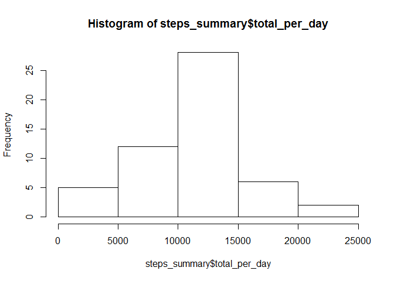
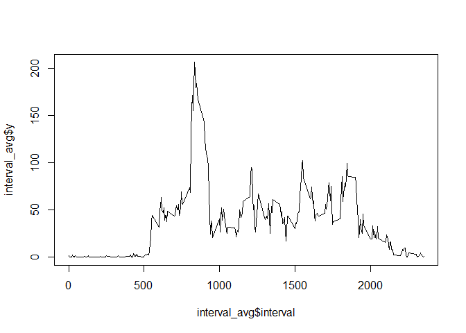
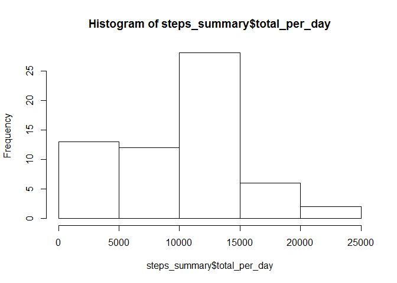
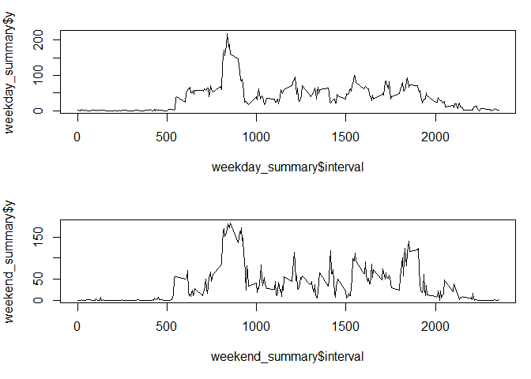

# Reproducible Research: Peer Assessment 1

Initially setup our working directory and load the dplyr library.


```r
library(dplyr)

setwd("D:/dev/Coursera/assignments/rr_project1/RepData_PeerAssessment1")
```

## Loading and preprocessing the data

The activity file is loaded and processed.


```r
activity_data = read.csv("data/activity.csv")
steps_per_day <- group_by(activity_data, date)
```


## What is mean total number of steps taken per day?

The table below shows the total, mean and median per day.


```r
steps_summary <- summarize(steps_per_day, mean_per_day = mean(steps, na.rm=TRUE), median_per_day = median(steps,na.rm=TRUE), total_per_day = sum(steps))
print(select(steps_summary,date,mean_per_day,median_per_day,total_per_day),n=100)
```

```
## Source: local data frame [61 x 4]
## 
##          date mean_per_day median_per_day total_per_day
##        (fctr)        (dbl)          (dbl)         (int)
## 1  01/10/2012          NaN             NA            NA
## 2  01/11/2012          NaN             NA            NA
## 3  02/10/2012    0.4375000              0           126
## 4  02/11/2012   36.8055556              0         10600
## 5  03/10/2012   39.4166667              0         11352
## 6  03/11/2012   36.7048611              0         10571
## 7  04/10/2012   42.0694444              0         12116
## 8  04/11/2012          NaN             NA            NA
## 9  05/10/2012   46.1597222              0         13294
## 10 05/11/2012   36.2465278              0         10439
## 11 06/10/2012   53.5416667              0         15420
## 12 06/11/2012   28.9375000              0          8334
## 13 07/10/2012   38.2465278              0         11015
## 14 07/11/2012   44.7326389              0         12883
## 15 08/10/2012          NaN             NA            NA
## 16 08/11/2012   11.1770833              0          3219
## 17 09/10/2012   44.4826389              0         12811
## 18 09/11/2012          NaN             NA            NA
## 19 10/10/2012   34.3750000              0          9900
## 20 10/11/2012          NaN             NA            NA
## 21 11/10/2012   35.7777778              0         10304
## 22 11/11/2012   43.7777778              0         12608
## 23 12/10/2012   60.3541667              0         17382
## 24 12/11/2012   37.3784722              0         10765
## 25 13/10/2012   43.1458333              0         12426
## 26 13/11/2012   25.4722222              0          7336
## 27 14/10/2012   52.4236111              0         15098
## 28 14/11/2012          NaN             NA            NA
## 29 15/10/2012   35.2048611              0         10139
## 30 15/11/2012    0.1423611              0            41
## 31 16/10/2012   52.3750000              0         15084
## 32 16/11/2012   18.8923611              0          5441
## 33 17/10/2012   46.7083333              0         13452
## 34 17/11/2012   49.7881944              0         14339
## 35 18/10/2012   34.9166667              0         10056
## 36 18/11/2012   52.4652778              0         15110
## 37 19/10/2012   41.0729167              0         11829
## 38 19/11/2012   30.6979167              0          8841
## 39 20/10/2012   36.0937500              0         10395
## 40 20/11/2012   15.5277778              0          4472
## 41 21/10/2012   30.6284722              0          8821
## 42 21/11/2012   44.3993056              0         12787
## 43 22/10/2012   46.7361111              0         13460
## 44 22/11/2012   70.9270833              0         20427
## 45 23/10/2012   30.9652778              0          8918
## 46 23/11/2012   73.5902778              0         21194
## 47 24/10/2012   29.0104167              0          8355
## 48 24/11/2012   50.2708333              0         14478
## 49 25/10/2012    8.6527778              0          2492
## 50 25/11/2012   41.0902778              0         11834
## 51 26/10/2012   23.5347222              0          6778
## 52 26/11/2012   38.7569444              0         11162
## 53 27/10/2012   35.1354167              0         10119
## 54 27/11/2012   47.3819444              0         13646
## 55 28/10/2012   39.7847222              0         11458
## 56 28/11/2012   35.3576389              0         10183
## 57 29/10/2012   17.4236111              0          5018
## 58 29/11/2012   24.4687500              0          7047
## 59 30/10/2012   34.0937500              0          9819
## 60 30/11/2012          NaN             NA            NA
## 61 31/10/2012   53.5208333              0         15414
```

```r
hist(steps_summary$total_per_day)
```



## What is the average daily activity pattern?

The average daily activity pattern is as follows.


```r
steps_per_interval <- group_by(activity_data, interval)
interval_avg <- summarize (steps_per_interval, y=mean(steps, na.rm = TRUE))
plot(interval_avg$interval,interval_avg$y, type="l")
```



```r
arrange(interval_avg,desc(y))
```

```
## Source: local data frame [288 x 2]
## 
##    interval        y
##       (int)    (dbl)
## 1       835 206.1698
## 2       840 195.9245
## 3       850 183.3962
## 4       845 179.5660
## 5       830 177.3019
## 6       820 171.1509
## 7       855 167.0189
## 8       815 157.5283
## 9       825 155.3962
## 10      900 143.4528
## ..      ...      ...
```

835 is the interval with the highest average number of steps across all days.

## Imputing missing values

1. The total number of rows with NAs is as follows...


```r
sum(is.na(activity_data))
```

```
## [1] 2304
```

2. We are going to populate the missing values by giving them the mean of that days intervals


```r
means <- summarize(steps_per_day, avg = mean(steps,na.rm = TRUE))
means[is.na(means)] = 0
new_activity_data <- activity_data
new_activity_data <- merge(new_activity_data,means)
new_activity_data <- mutate(new_activity_data, steps = ifelse(is.na(steps),avg,steps))

steps_per_day <- group_by(new_activity_data, date)
steps_summary <- summarize(steps_per_day, mean_per_day = mean(steps, na.rm=TRUE), median_per_day = median(steps,na.rm=TRUE), total_per_day = sum(steps))
print(select(steps_summary,date,total_per_day),n=100)
```

```
## Source: local data frame [61 x 2]
## 
##          date total_per_day
##        (fctr)         (dbl)
## 1  01/10/2012             0
## 2  01/11/2012             0
## 3  02/10/2012           126
## 4  02/11/2012         10600
## 5  03/10/2012         11352
## 6  03/11/2012         10571
## 7  04/10/2012         12116
## 8  04/11/2012             0
## 9  05/10/2012         13294
## 10 05/11/2012         10439
## 11 06/10/2012         15420
## 12 06/11/2012          8334
## 13 07/10/2012         11015
## 14 07/11/2012         12883
## 15 08/10/2012             0
## 16 08/11/2012          3219
## 17 09/10/2012         12811
## 18 09/11/2012             0
## 19 10/10/2012          9900
## 20 10/11/2012             0
## 21 11/10/2012         10304
## 22 11/11/2012         12608
## 23 12/10/2012         17382
## 24 12/11/2012         10765
## 25 13/10/2012         12426
## 26 13/11/2012          7336
## 27 14/10/2012         15098
## 28 14/11/2012             0
## 29 15/10/2012         10139
## 30 15/11/2012            41
## 31 16/10/2012         15084
## 32 16/11/2012          5441
## 33 17/10/2012         13452
## 34 17/11/2012         14339
## 35 18/10/2012         10056
## 36 18/11/2012         15110
## 37 19/10/2012         11829
## 38 19/11/2012          8841
## 39 20/10/2012         10395
## 40 20/11/2012          4472
## 41 21/10/2012          8821
## 42 21/11/2012         12787
## 43 22/10/2012         13460
## 44 22/11/2012         20427
## 45 23/10/2012          8918
## 46 23/11/2012         21194
## 47 24/10/2012          8355
## 48 24/11/2012         14478
## 49 25/10/2012          2492
## 50 25/11/2012         11834
## 51 26/10/2012          6778
## 52 26/11/2012         11162
## 53 27/10/2012         10119
## 54 27/11/2012         13646
## 55 28/10/2012         11458
## 56 28/11/2012         10183
## 57 29/10/2012          5018
## 58 29/11/2012          7047
## 59 30/10/2012          9819
## 60 30/11/2012             0
## 61 31/10/2012         15414
```

```r
hist(steps_summary$total_per_day)
```



There is no real impact of inputting the missing values to the histogram or table. 

## Are there differences in activity patterns between weekdays and weekends?

There is more activity at the weekend.


```r
activity_data <- mutate(activity_data, day = as.factor(
                                        ifelse(weekdays(as.Date(date))=='Saturday'| weekdays(as.Date(date)) == 'Sunday',
                                        'Weekend','Weekday')))

weekday_steps <- subset(activity_data,day == 'Weekday')
weekend_steps <- subset(activity_data,day == 'Weekend')

steps_per_weekday <- group_by(weekday_steps, interval)
steps_per_weekend <- group_by(weekend_steps, interval)

weekday_summary <- summarize (steps_per_weekday, y=mean(steps, na.rm = TRUE))
weekend_summary <- summarize (steps_per_weekend, y=mean(steps, na.rm = TRUE))

par(mfrow = c(2, 1), mar = c(5, 4, 2, 1)) 
plot(weekday_summary$interval,weekday_summary$y, type="l")
plot(weekend_summary$interval,weekend_summary$y, type="l")
```


